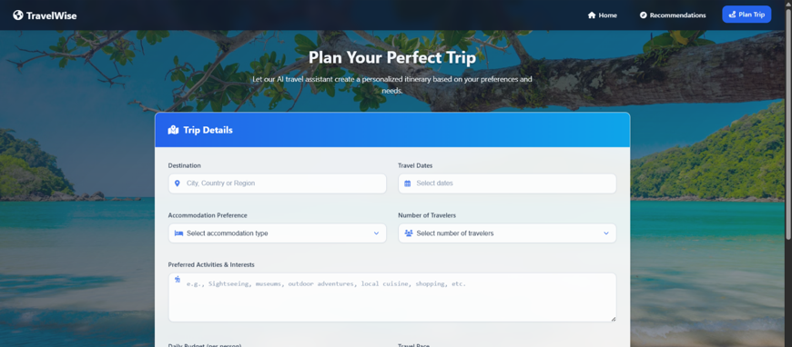
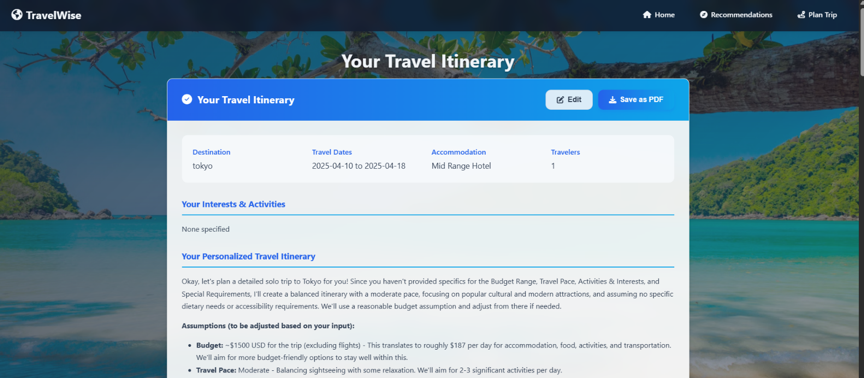
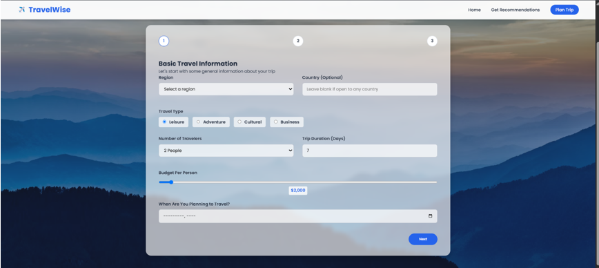
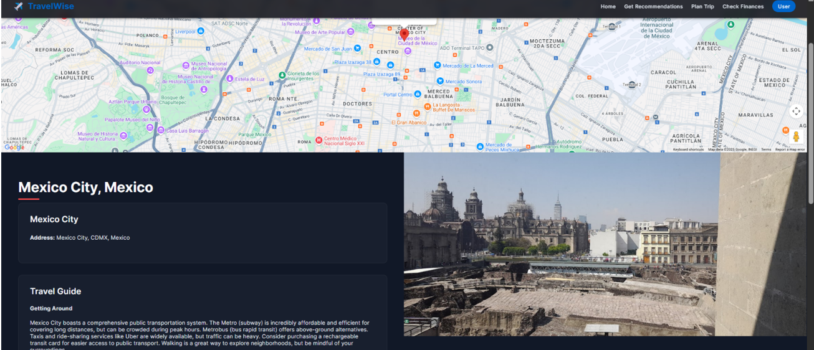
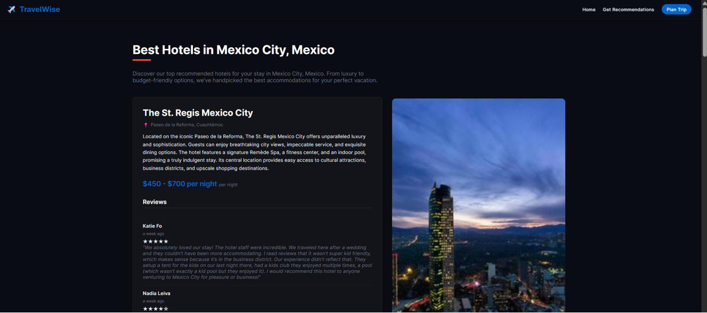
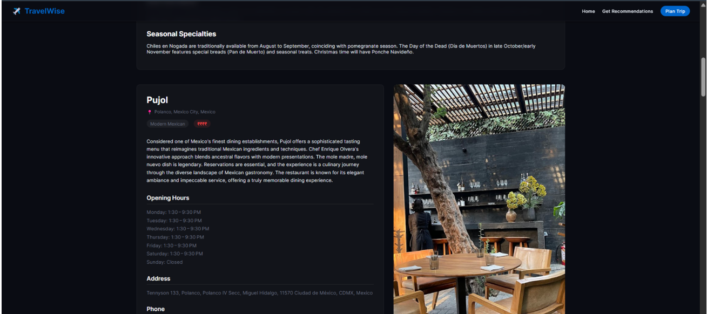

# TravelWise

**TravelWise** is a comprehensive and intelligent travel planning web application that delivers personalized recommendations for destinations, hotels, restaurants, must-visit places, and adventure activities. It simplifies the end-to-end process of planning a trip by integrating real-time data, AI-based suggestions, interactive exploration, and downloadable itineraries in PDF format.

---

## Features

- Personalized destination, hotel, restaurant, and activity recommendations
- Explore detailed location information with photos, reviews, and ratings
- Smart itinerary generation based on:
  - Number of travel days
  - Group size
  - Budget
  - Preferred activities
- Downloadable PDF trip plans
- Integration with Google Maps for geolocation and exploration
- Gemini API-based content generation for enhanced recommendations

---

## Tech Stack

**Frontend:**
- HTML
- CSS
- JavaScript

**Backend:**
- Python (Flask)

**APIs:**
- Gemini API (for intelligent recommendations and dynamic content)
- Google Maps API (for maps, photos, and location details)
- Weather API (optional enhancements)

**Tools:**
- Postman (for backend testing)
- SonarQube (for static code analysis)
- Jira (for project management and sprint tracking)

---

## Setup Instructions

1. **Clone the Repository**

```bash
git clone https://github.com/an-iqbal/travelwise.git
cd travelwise
```

   
2. **Install the required Python packages:**

```bash  
pip install -r requirements.txt
```

3. **Create a .env file in the root directory and add your API keys:**

```bash
GEMINI_API_KEY=your_gemini_api_key
GOOGLE_MAPS_API_KEY=your_google_maps_api_key
```

4. **Run the application:**

```bash
python app.py
```

5. **Open your browser and navigate to:**

```bash
http://127.0.0.1:5000
```

---

##  Screenshots

###  Home Page


###  Plan Trip


###  Travel Itinerary


###  Travel Recommendation


###  Explore City


###  Hotel Recommendation


###  Restaurant Recommendation


---

##  Contact Us  

Have questions or suggestions? I’d love to hear from you!  

-  Anwar Iqbal: [anwar.iqbal1390@gmail.com](mailto:anwar.iqbal1390@gmail.com)  

---

##  Contributing  

Contributions are welcome! Feel free to submit issues or open pull requests to improve the platform.  

